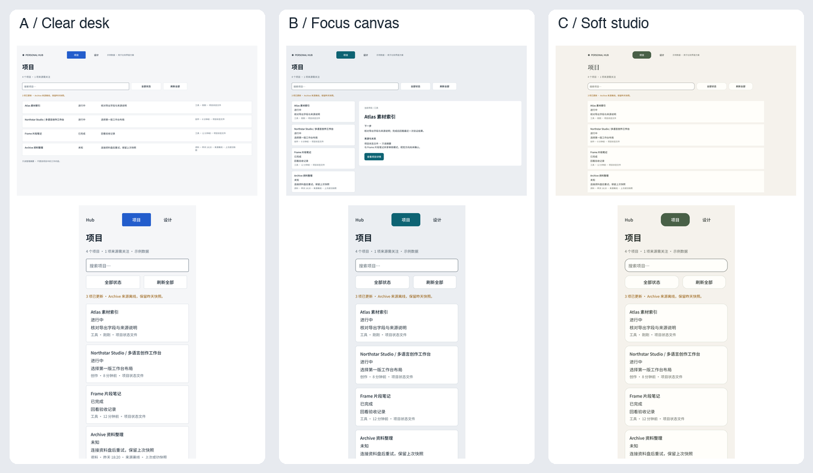

# Hub 三方向选稿 · v1

供所有者选择界面方向；这批是使用同一组合成项目的可编辑设计稿。尚未开始 Hub 前端实现。

| 方向 | 使用特点 | Figma 原稿 |
|---|---|---|
| A 清晰编辑台 | 紧凑行式总览，便于扫描多个项目的状态和下一步。建议作为日常管理起点。 | [桌面](https://www.figma.com/design/AjYCtyxV5mmXNqWPtJQRQ4?node-id=14-20) · [手机](https://www.figma.com/design/AjYCtyxV5mmXNqWPtJQRQ4?node-id=14-83) |
| B 专注画布 | 左侧列表与右侧项目摘要并列，适合围绕一个项目连续查看。 | [桌面](https://www.figma.com/design/AjYCtyxV5mmXNqWPtJQRQ4?node-id=14-139) · [手机](https://www.figma.com/design/AjYCtyxV5mmXNqWPtJQRQ4?node-id=14-212) |
| C 柔和工作室 | 居中阅读列、衬线标题与更柔和的圆角；长列表需要更多滚动。 | [桌面](https://www.figma.com/design/AjYCtyxV5mmXNqWPtJQRQ4?node-id=14-268) · [手机](https://www.figma.com/design/AjYCtyxV5mmXNqWPtJQRQ4?node-id=14-325) |

每方向有 12 张画板：项目总览、项目详情、设计列表、设计比较、状态样例均有桌面 1440×900 和手机 390×844；另有手机原版占位与 200% 文字样例。原版明确显示“当前无图形界面”，依据现有功能规格新建。

Figma 保留原生文字、自动布局、组件实例、变量与样式。133 条查看路径已读回核对；同方案页面通过原型跳转，跨方案入口打开对应可编辑画板。缩略画布提供完整画板的放大入口。

`exports.json` 记录 58 份 PNG 的原稿节点、内容摘要、尺寸和文件哈希。视口导出保持指定尺寸；完整内容导出使用立即移除的原生副本，补入与原画板相同的画布背景。`readback/export-consistency.json` 记录导出前后摘要一致、没有遗留临时画板。对照图由六份总览导出拼接，只用于快速比较。

可查看 [A 恢复状态](previews/A--states--mobile--grid.png)、[B 手机决定区](previews/B--compare--mobile--body.png)、[C 200% 文字](previews/C--text200--mobile--content.png)。全部文件索引见 `exports.json`，全部画板入口见 `figma.json`。

本阶段验证的是设计和导出：670 个文字、组件与控件节点匹配编译输入；无横向越界或未提供滚动的纵向溢出；33 组正文配色对比度均达到 4.5:1，最小 5.1817:1。搜索与反馈框边界及焦点轮廓也使用已核对的语义颜色。

浏览器键盘交互、真实 200% 缩放、保存持久化、草稿恢复、实际项目接入和导出服务仍为 **UNVERIFIED**，须在选定方案后的实施中验证。Figma 中的控件与状态不代表这些行为已实现。Hub 浏览器控制台和网络检查在本设计单元为 **NOT_APPLICABLE**。

选择可以是 A、B、C，也可以说明要融合的部分。设计选择与实施授权分别记录；整体 Goal 仍在进行。

复核：`python3 docs/reports/ui_design_governance/unit-13/verify_candidate.py`。Figma 内容摘要的只读复算逻辑在 `readback-script.js`；以 `figma.json` 的页与节点映射提供 PAGE、ROOTS 和 EXPECTED 输入。该脚本对渲染节点、文字、绑定和查看动作计算 SHA-256，省略隐藏子树；算法已与 Python hashlib 的 ASCII、中文、Emoji 和多块输入结果核对。
