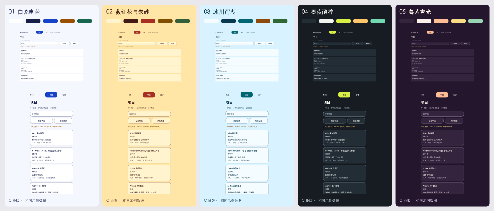

# C 排版 · 五套配色

已按你的选择保留 C 的排版、字体、圆角、间距和内容。以下五套方案都使用同一份示例数据；最终配色仍待你选择。

| 方案 | 气质与取舍 | 原稿与大图 |
|---|---|---|
| 1 白瓷电蓝 | 冷白与电蓝，清晰利落的数字画廊。最克制，适合长期日常使用。 | [Figma](https://www.figma.com/design/AjYCtyxV5mmXNqWPtJQRQ4?node-id=91-1467) · [桌面与手机大图](previews/P1--comparison.png) |
| 2 藏红花与朱砂 | 金黄底与朱砂红，温暖浓烈的印刷感。最鲜明的浅色方案，暖色存在感强。 | [Figma](https://www.figma.com/design/AjYCtyxV5mmXNqWPtJQRQ4?node-id=91-1781) · [桌面与手机大图](previews/P2--comparison.png) |
| 3 冰川泻湖 | 冰蓝底与深海青，清透冷静。轻盈舒展，整体情绪偏冷。 | [Figma](https://www.figma.com/design/AjYCtyxV5mmXNqWPtJQRQ4?node-id=91-2095) · [桌面与手机大图](previews/P3--comparison.png) |
| 4 墨夜酸柠 | 蓝黑底与酸柠黄，醒目的夜间工作台。辨识度高，主操作的视觉刺激较强。 | [Figma](https://www.figma.com/design/AjYCtyxV5mmXNqWPtJQRQ4?node-id=91-2409) · [桌面与手机大图](previews/P4--comparison.png) |
| 5 暮紫杏光 | 深梅紫与杏桃色，温暖而有戏剧性。最衬 C 的衬线标题，个人风格鲜明。 | [Figma](https://www.figma.com/design/AjYCtyxV5mmXNqWPtJQRQ4?node-id=91-2723) · [桌面与手机大图](previews/P5--comparison.png) |

推荐 **5 暮紫杏光**，它与 C 的衬线标题最协调。喜欢浅色、希望更有个性时，推荐 **2 藏红花与朱砂**；希望清爽克制时选 **1 白瓷电蓝**。

每套都保留可编辑的桌面项目页、手机项目页、桌面设计比较页和手机状态页，共 20 张画板。25 份原稿导出包含完整状态长图；20 份视口导出保持 1440×900 或 390×844。六张对照图只拼接这些原生导出。颜色角色和十六进制值见 palettes.json，具体节点与导出身份见 figma.json、readback.json 和 exports.json。

原 C 布局的颜色外结构签名一致。原生副本中四个缩略卡片高度产生约 0.000004px 的浮点差异；仅坐标与尺寸按 0.001px 精度归一化，其余排版与内容字段精确比较。原来的 36 张画板与 6 个基础节点以及已有变量和样式未改动。

正文、辅助文字、强调色与状态色均对画布、卡片、浅色底检查 ≥4.5:1；按钮文字 ≥4.5:1；边界与焦点 ≥3:1。状态仍保留文字说明。控件示例的运行、保存、持久化、实际接入尚未实现；浏览器控制台和网络检查不适用于本设计单元。复制的查看链接沿用 C 的示例路线，可能打开原 C 画板；这里用于选配色，不代表完整的换肤交互已经实现。

复核命令：`python3 docs/reports/ui_design_governance/unit-14/verify_candidate.py`。readback.js 为原生只读复核脚本；clone-palettes.js 记录纯配色复制和结构比较方法。

请选择 **1–5**，也可以说明要融合的颜色。C 排版已确定，无需重新选择排版。
